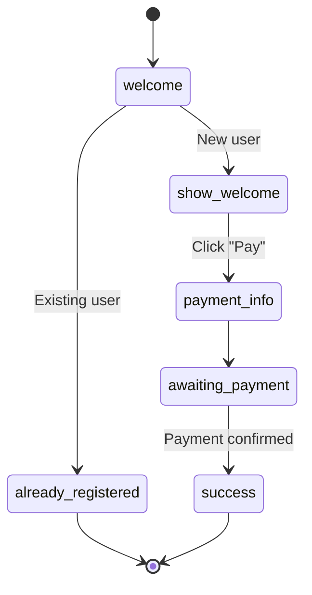

# Migration Guide: payment_bot.py → bot_flow/flows/payment_flow.py

## Что изменилось?

Проект перешёл на **единую декларативную версию бота** на основе `bot_flow` framework.

### До

```
payment_bot.py                   # Императивная версия (232 строки)
bot_flow/flows/payment_flow.py   # Декларативная версия (40 строк логики)
main.py                          # payment, payment-flow
```

### После

```
payment_bot.py.old               # Архивная версия (для справки)
bot_flow/flows/payment_flow.py   # Единственная версия [DEFAULT]
main.py                          # payment → bot_flow version
```

## Преимущества новой версии

### 1. Компактность

- **Старая версия:** 232 строки императивного кода
- **Новая версия:** ~40 строк декларативного flow
- **Экономия:** 80% меньше кода при той же функциональности

### 2. Дополнительные функции

✅ Проверка существующей регистрации (предотвращение дубликатов)
✅ Динамическая загрузка текстов из NocoDB
✅ Динамическая загрузка конфигурации из NocoDB
✅ Автоматическая визуализация flow (Mermaid, GraphViz)
✅ Graceful shutdown из коробки

### 3. Поддерживаемость

- Вся логика flow видна в одном месте
- Легко добавлять новые состояния
- Автоматическая валидация переходов
- Встроенная поддержка polling

## Как запускать

### Раньше

```bash
# Два способа запуска
python payment_bot.py            # Старая версия
python main.py payment-flow      # Новая версия
```

### Теперь

```bash
# Один способ запуска
python main.py                   # Декларативная версия [DEFAULT]
python main.py payment           # То же самое

# Прямой запуск
python bot_flow/flows/payment_flow.py
```

## API изменения

### Нет breaking changes!

Все функции сохранены:

- ✅ `/start` command
- ✅ Payment button callback
- ✅ NocoDB integration
- ✅ Payment status polling (10 sec interval)
- ✅ Success message with group link

### Новые функции

```python
# 1. Проверка существующей регистрации
async def check_user_registration(ctx: FlowContext) -> bool:
    """Проверяет, есть ли уже запись для этого user_id в NocoDB"""

# 2. Динамическая загрузка текстов
async def reload_texts_and_config(ctx: FlowContext) -> None:
    """Загружает тексты и конфиг из NocoDB при каждом /start"""
```

## Структура flow



## Graceful Shutdown

Новая версия поддерживает корректное завершение:

```bash
python main.py payment

# Нажмите Ctrl+C
# ⚠️  Received signal 2, initiating shutdown...
# 🛑 Shutting down gracefully...
# ⏹️  Cancelling 1 polling tasks...
# ✅ All polling tasks cancelled
# ⏹️  Stopping bot application...
# ✅ Bot stopped cleanly
# 👋 Goodbye!
```

## Визуализация

Новая версия позволяет экспортировать диаграммы flow:

```bash
python main.py visualize

# Генерирует:
# - docs/payment_flow.md  (Mermaid)
# - docs/payment_flow.dot (GraphViz)
# - docs/payment_flow.txt (ASCII)
```

## Откат (если нужно)

Старая версия сохранена в `payment_bot.py.old`:

```bash
# Восстановить старую версию
mv payment_bot.py.old payment_bot.py

# Запустить
python payment_bot.py
```

**Внимание:** Старая версия не имеет:
- Проверки существующей регистрации
- Динамической загрузки текстов
- Graceful shutdown
- Визуализации flow

## Рекомендации

1. **Используйте новую версию** - она проще и функциональнее
2. **Изучите flow** - запустите `python main.py visualize`
3. **Настройте тексты в NocoDB** - они загружаются динамически
4. **Используйте Ctrl+C** - бот корректно завершится

## Дополнительные ресурсы

- [bot_flow/README.md](bot_flow/README.md) - FlowBuilder API
- [docs/FLOW_BUILDER_GUIDE.md](docs/FLOW_BUILDER_GUIDE.md) - Полное руководство
- [docs/GRACEFUL_SHUTDOWN.md](docs/GRACEFUL_SHUTDOWN.md) - Graceful shutdown guide
- [docs/payment_flow.md](docs/payment_flow.md) - Диаграмма flow

## Вопросы?

Смотрите:
- `python main.py help` - список команд
- `python main.py status` - проверка конфигурации
- [CLAUDE.md](CLAUDE.md) - документация проекта
