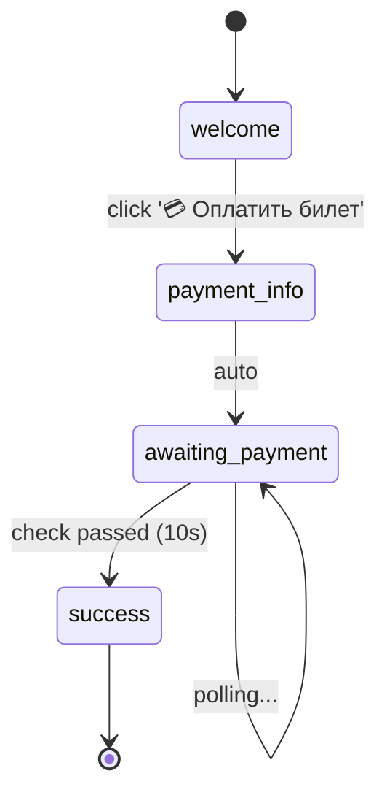

# MeetPing-Pay

**MeetPing-Pay** - это система Telegram ботов для обработки платежей за билеты на мероприятия с интеграцией NocoDB.

Проект включает:
- 💳 **Payment Bot** - бот для приёма платежей за билеты
- 🔧 **Bot Flow Framework** - декларативный фреймворк для создания Telegram ботов
- 📊 **Автоматическая визуализация** - генерация диаграмм user flow

---

## 🚀 Быстрый старт

### Установка

```bash
# 1. Клонировать репозиторий
git clone <repo-url>
cd meetping-pay

# 2. Установить зависимости
pip install -r requirements.txt

# 3. Настроить .env
cp .env.example .env
# Отредактировать .env: добавить BOT_TOKEN, NOCODB_API_TOKEN, etc.
```

### Запуск ботов

```bash
# Сделать скрипт исполняемым
chmod +x run_bot.sh

# Запустить оригинальный payment bot
./run_bot.sh original

# Запустить декларативную версию на bot_flow
./run_bot.sh flow

# Запустить примеры bot_flow
./run_bot.sh demo menu
./run_bot.sh demo timer

# Сгенерировать визуализации
./run_bot.sh visualize
```

---

## 📦 Структура проекта

```
meetping-pay/
├── bot_flow/                   # Declarative bot framework ⭐
│   ├── core/                   # Ядро фреймворка
│   │   ├── state.py           # StateNode, Flow, PollingConfig
│   │   ├── builder.py         # FlowBuilder (Fluent API)
│   │   ├── executor.py        # FlowExecutor
│   │   └── visualizer.py      # Mermaid/GraphViz генератор
│   ├── flows/
│   │   └── payment_flow.py    # Декларативный payment bot
│   ├── examples/
│   │   └── demo.py            # 5 примеров ботов
│   └── README.md              # API документация
│
├── docs/                       # Документация
│   ├── FLOW_BUILDER_GUIDE.md          # Полное руководство
│   ├── DECLARATIVE_BOT_APPROACHES.md  # Сравнение подходов
│   └── payment_flow.md                # Визуализация flow
│
├── payment_bot.py              # Оригинальный императивный бот
├── agent.py                    # Пример Anthropic Agents SDK
├── mcp-test.py                 # LangChain + OpenAI интеграция
│
├── visualize_payment_flow.py   # Скрипт визуализации
├── run_bot.sh                  # 🎯 Главный скрипт запуска
│
├── test_payment_bot.py         # Unit тесты
├── test_integration_nocodb.py  # Integration тесты
│
├── requirements.txt            # Python зависимости
├── .env.example                # Пример конфигурации
├── CLAUDE.md                   # Инструкции для Claude Code
└── README.md                   # Этот файл
```

---

## 💳 Payment Bot

Telegram бот для обработки платежей за билеты на мероприятия.

### Функции

- `/start` - приветствие и кнопка оплаты
- Создание записи в NocoDB при клике на "Оплатить билет"
- Polling NocoDB каждые 10 секунд для проверки статуса оплаты
- Автоматическое подтверждение при изменении статуса в NocoDB
- Отправка ссылки на группу после подтверждения оплаты

### Конфигурация (.env)

```bash
# Telegram
BOT_TOKEN=your_telegram_bot_token

# NocoDB
NOCODB_API_URL=https://app.nocodb.com
NOCODB_API_TOKEN=your_nocodb_token
NOCODB_TABLE_ID=your_table_id

# Payment settings
PAYMENT_PHONE=+7 (999) 123-45-67
PAYMENT_AMOUNT=1000 рублей
TELEGRAM_GROUP_LINK=https://t.me/your_group
```

### Запуск

```bash
# Оригинальная версия (imperative)
python3 payment_bot.py
# ИЛИ
./run_bot.sh original

# Декларативная версия (bot_flow)
python3 bot_flow/flows/payment_flow.py
# ИЛИ
./run_bot.sh flow
```

### User Flow



См. [docs/payment_flow.md](docs/payment_flow.md) для полной визуализации.

---

## 🔧 Bot Flow Framework

Декларативный фреймворк для создания Telegram ботов с автоматической визуализацией.

### Особенности

✨ **Fluent API** - цепочка методов для построения графа состояний
```python
flow = (
    FlowBuilder("my_bot")
    .state("start").on_command("/start").reply("Hi!").button("Next", goto="next")
    .state("next").reply("Done!").final()
    .build()
)
```

📊 **Автоматическая визуализация** - генерация Mermaid/GraphViz диаграмм
```python
visualize(flow).export_mermaid("flow.md")
```

⏱️ **Polling** - встроенная поддержка асинхронных проверок
```python
.state("payment")
    .poll(check_payment, interval=10)
    .on_condition(is_paid, goto="success")
```

✅ **Валидация** - проверка графа на этапе построения
```python
.build()  # ValueError если граф невалидный
```

🎨 **Type hints** - полная поддержка IDE и автодополнение

### Быстрый пример

```python
from bot_flow.core import FlowBuilder, FlowExecutor

flow = (
    FlowBuilder("welcome_bot")
    .state("start")
        .on_command("/start")
        .reply("👋 Привет, {user.first_name}!")
        .button("Далее", goto="next")
    .state("next")
        .reply("Рад знакомству! 😊")
        .final()
    .build()
)

# Визуализация
visualize(flow).export_mermaid("my_flow.md")

# Запуск
executor = FlowExecutor(flow, bot_token=BOT_TOKEN)
executor.run()
```

### Примеры ботов

```bash
# Визуализировать все примеры
./run_bot.sh visualize

# Запустить конкретный пример
./run_bot.sh demo welcome    # Простой welcome bot
./run_bot.sh demo menu       # Бот с меню
./run_bot.sh demo survey     # Бот-опрос
./run_bot.sh demo timer      # Бот с таймером (polling)
./run_bot.sh demo age_gate   # Бот с условиями
```

### Документация

- 📖 [Bot Flow API Reference](bot_flow/README.md)
- 📘 [Flow Builder Guide](docs/FLOW_BUILDER_GUIDE.md) - полное руководство
- 📊 [Declarative Approaches](docs/DECLARATIVE_BOT_APPROACHES.md) - сравнение подходов

### Сравнение: Imperative vs Declarative

| Критерий | payment_bot.py | bot_flow |
|----------|----------------|----------|
| Строк кода | 232 | ~40 |
| Видимость flow | ❌ | ✅ |
| Визуализация | Manual | Auto |
| Валидация | Runtime | Build time |
| Тестирование | Сложное | Простое |

---

## 🧪 Тестирование

### Unit тесты

```bash
# Запустить все тесты
pytest test_payment_bot.py -v

# С покрытием
pytest test_payment_bot.py --cov=payment_bot --cov-report=html

# ИЛИ через скрипт
./run_bot.sh test
```

### Integration тесты (NocoDB)

```bash
# Настроить .env.test
cp .env.example .env.test
# Отредактировать .env.test: добавить NOCODB_API_TOKEN и NOCODB_TABLE_ID

# Запустить
pytest test_integration_nocodb.py -v -s
```

**Что тестируется:**
- ✅ Создание записей в NocoDB
- ✅ Чтение статуса платежа
- ✅ Обновление статуса (toggle Paid)
- ✅ Полный workflow платежа
- ✅ Обработка ошибок API

---

## 📊 Визуализация Flow

Автоматическая генерация диаграмм состояний:

```bash
# Визуализация payment_bot
python3 visualize_payment_flow.py

# Визуализация всех примеров
python3 bot_flow/examples/demo.py visualize

# ИЛИ через скрипт
./run_bot.sh visualize
```

**Генерируемые форматы:**
- 📄 `docs/payment_flow.md` - Mermaid diagram (GitHub-совместимый)
- 🌐 `docs/payment_flow.dot` - GraphViz DOT
- 📝 `docs/payment_flow.txt` - ASCII diagram

---

## 🛠️ Утилиты

### run_bot.sh - главный скрипт запуска

```bash
./run_bot.sh [command]

Commands:
  original          - Запустить payment_bot.py
  flow              - Запустить bot_flow payment bot
  demo [bot_name]   - Запустить пример из bot_flow/examples
  visualize         - Сгенерировать все диаграммы
  test              - Запустить тесты
```

### visualize_payment_flow.py - генератор диаграмм

```bash
python3 visualize_payment_flow.py
# → docs/payment_flow.md
# → docs/payment_flow.dot
# → docs/payment_flow.txt
```

---

## 🔐 NocoDB Integration

### Требуемые поля таблицы

| Field | Type | Description |
|-------|------|-------------|
| `TG` | Text | Telegram username |
| `TG ID` | Number | Telegram user ID |
| `Price` | Number | Ticket price |
| `Paid` | Checkbox | Payment status (toggle this) |
| `CreatedAt` | DateTime | Auto-generated |
| `UpdatedAt` | DateTime | Auto-generated |

### API Endpoints

- `POST /api/v2/tables/{table_id}/records` - Create payment record
- `GET /api/v2/tables/{table_id}/records/{record_id}` - Check status
- `PATCH /api/v2/tables/{table_id}/records/{record_id}` - Update status

### Workflow

1. User clicks "Оплатить билет" → bot creates NocoDB record
2. Bot starts polling record every 10 seconds
3. Admin switches `Paid` toggle to `true` in NocoDB
4. Bot detects change → sends success message with group link

---

## 📚 Дополнительные примеры

### agent.py - Anthropic Agents SDK

```bash
python3 agent.py
```

Пример использования Anthropic Agents SDK для создания бота с guardrails.

### mcp-test.py - LangChain + OpenAI

```bash
python3 mcp-test.py
```

Интеграция с LangChain и OpenAI для MCP тестирования.

---

## 🤝 Вклад

Создавайте issues и pull requests!

### Идеи для улучшения

- [ ] Middleware поддержка в bot_flow
- [ ] Subflows (вложенные flow)
- [ ] Интерактивная HTML визуализация
- [ ] Больше примеров ботов
- [ ] aiogram executor (альтернатива python-telegram-bot)

---

## 📄 Лицензия

MIT

---

## 🔗 Полезные ссылки

- [Telegram Bot API](https://core.telegram.org/bots/api)
- [python-telegram-bot](https://github.com/python-telegram-bot/python-telegram-bot)
- [NocoDB](https://nocodb.com/)
- [Mermaid Live Editor](https://mermaid.live/)

---

**Built with** ❤️ **using Claude Code**
