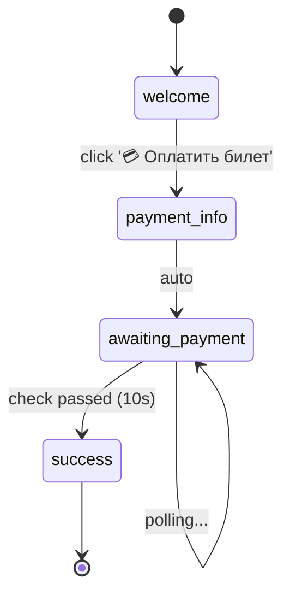

# Bot Flow - Declarative Telegram Bot Framework

Fluent API для создания Telegram ботов с автоматической визуализацией user flow.

## ✨ Особенности

- **Декларативный синтаксис** - описывайте "что", а не "как"
- **Fluent API** - удобный builder с автодополнением в IDE
- **Автоматическая визуализация** - генерация Mermaid/GraphViz диаграмм
- **Polling поддержка** - для асинхронных проверок (платежи, таймеры)
- **Валидация графа** - ошибки при построении, а не в runtime
- **Type hints** - полная типизация для IDE

## 🚀 Быстрый старт

### Простой бот

```python
from bot_flow.core import FlowBuilder, FlowExecutor

flow = (
    FlowBuilder("welcome_bot")

    .state("start")
        .on_command("/start")
        .reply("👋 Привет! Я простой бот.")
        .button("Поздороваться", goto="greet")

    .state("greet")
        .reply("Привет! Рад знакомству! 😊")
        .final()

    .build()
)

# Визуализация
flow.visualize().export_mermaid("my_bot_flow.md")

# Запуск
executor = FlowExecutor(flow, bot_token="YOUR_TOKEN")
executor.run()
```

### Бот с polling (проверка оплаты)

```python
async def create_payment(ctx):
    record_id = await nocodb.create_record(ctx.user.id)
    ctx.set('record_id', record_id)

async def check_payment(ctx) -> bool:
    record_id = ctx.get('record_id')
    return await nocodb.is_paid(record_id)

flow = (
    FlowBuilder("payment_bot")

    .state("welcome")
        .on_command("/start")
        .reply("Нажмите для оплаты:")
        .button("💳 Оплатить", goto="payment")

    .state("payment")
        .action(create_payment)
        .reply("⏳ Ожидаем оплату...")
        .poll(check_payment, interval=10)
        .on_condition(lambda ctx: ctx.poll_result, goto="success")

    .state("success")
        .reply("✅ Оплачено!")
        .final()

    .build()
)
```

## 📊 Визуализация

### Автоматическая генерация диаграмм

```python
from bot_flow.core import visualize

viz = visualize(flow)

# Mermaid (для GitHub/документации)
viz.export_mermaid("flow.md")

# GraphViz DOT
viz.export_graphviz("flow.dot")

# ASCII (для консоли)
print(viz.to_ascii())
```

### Пример визуализации (payment_bot)



## 📖 API Reference

### FlowBuilder

```python
FlowBuilder(name: str)
    .state(name: str) -> StateBuilder
    .build() -> Flow
```

### StateBuilder

```python
StateBuilder
    # Триггеры
    .on_command(command: str)           # /start, /help
    .on_callback(pattern: str)          # callback_data
    .on_message()                       # любое сообщение

    # Действия
    .action(func: Callable)             # выполнить функцию
    .on_enter(func: Callable)           # при входе в состояние

    # Сообщения
    .reply(text: str, **kwargs)         # отправить сообщение
    .button(text: str, goto: str)       # добавить кнопку

    # Переходы
    .transition(to: str)                # автопереход
    .poll(func, interval=10)            # проверка каждые N сек
    .on_condition(pred, goto: str)      # условный переход

    # Финализация
    .final()                            # финальное состояние
    .build() -> Flow                    # построить flow
```

### FlowContext

Контекст передается в actions:

```python
async def my_action(ctx: FlowContext):
    # Данные пользователя
    ctx.user.id
    ctx.user.first_name
    ctx.user.username

    # Хранение данных
    ctx.set('key', 'value')
    value = ctx.get('key')

    # Результат polling
    if ctx.poll_result:
        # polling вернул True
        pass

    # Форматирование сообщений
    msg = ctx.format_message("Привет, {user.first_name}!")
```

## 📁 Структура проекта

```
bot_flow/
├── core/
│   ├── state.py          # StateNode, Flow, PollingConfig
│   ├── builder.py        # FlowBuilder, StateBuilder
│   ├── executor.py       # FlowExecutor, FlowContext
│   └── visualizer.py     # FlowVisualizer
├── flows/
│   └── payment_flow.py   # Пример: payment bot
└── examples/
    └── demo.py           # 5 примеров ботов
```

## 🎯 Примеры

### 1. Простой welcome bot
```bash
python3 bot_flow/examples/demo.py run welcome
```

### 2. Бот-опрос (survey)
```bash
python3 bot_flow/examples/demo.py run survey
```

### 3. Бот с меню
```bash
python3 bot_flow/examples/demo.py run menu
```

### 4. Бот с таймером (polling)
```bash
python3 bot_flow/examples/demo.py run timer
```

### 5. Бот с условиями (age gate)
```bash
python3 bot_flow/examples/demo.py run age_gate
```

### Визуализация всех примеров
```bash
python3 bot_flow/examples/demo.py visualize
```

## 🔄 Сравнение: до и после

### Императивный подход (payment_bot.py - 232 строки)

```python
async def start(update, context):
    keyboard = [[InlineKeyboardButton(...)]]
    await update.message.reply_text(..., reply_markup=...)

async def payment_button(update, context):
    record_id = await create_payment_record(...)
    pending_payments[user_id] = record_id
    asyncio.create_task(check_payment_status(...))

async def check_payment_status(context, user_id, chat_id):
    while user_id in pending_payments:
        await asyncio.sleep(10)
        if await check_payment_in_nocodb(...):
            await context.bot.send_message(...)
            del pending_payments[user_id]
            break

application.add_handler(CommandHandler("start", start))
application.add_handler(CallbackQueryHandler(payment_button, ...))
```

**Проблемы:**
- ❌ Логика размазана по функциям
- ❌ Flow не виден сразу
- ❌ Нет визуализации
- ❌ Сложно тестировать

### Декларативный подход (FlowBuilder - ~40 строк)

```python
payment_flow = (
    FlowBuilder("payment_bot")

    .state("welcome")
        .on_command("/start")
        .reply("👋 Привет!")
        .button("💳 Оплатить", goto="payment")

    .state("payment")
        .action(create_payment_record)
        .reply("💰 Инфо для оплаты...")
        .poll(check_payment, interval=10)
        .on_condition(is_paid, goto="success")

    .state("success")
        .reply("✅ Готово!")
        .final()

    .build()
)

executor = FlowExecutor(payment_flow, bot_token)
executor.run()
```

**Преимущества:**
- ✅ Весь flow виден сразу
- ✅ Автовизуализация одной строкой
- ✅ Простое тестирование
- ✅ Валидация графа на этапе построения

## 🧪 Тестирование

```python
def test_payment_flow():
    flow = build_payment_flow()

    # Структура
    assert flow.has_state("welcome")
    assert flow.get_state("welcome").has_transition_to("payment_info")

    # Путь
    path = flow.find_path("welcome", "success")
    assert path == ["welcome", "payment_info", "awaiting_payment", "success"]

    # Визуальная регрессия
    mermaid = visualize(flow).to_mermaid()
    assert "welcome --> payment_info" in mermaid
```

## 🎨 Расширения

### Middleware

```python
async def log_transitions(ctx, from_state, to_state):
    print(f"User {ctx.user.id}: {from_state} -> {to_state}")

flow = (
    FlowBuilder("bot")
    .middleware(log_transitions)
    .state(...)
)
```

### Вложенные flow (subflows)

```python
payment_subflow = build_stripe_payment_flow()

flow = (
    FlowBuilder("main")
    .state("checkout")
        .subflow(payment_subflow)
        .on_complete(goto="success")
)
```

## 📄 Лицензия

MIT

## 🤝 Вклад

Добро пожаловать! Создавайте issues и PR.
