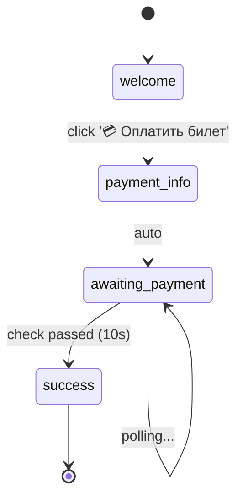

# Декларативные подходы к Telegram ботам

## Обзор подходов

### 1. FSM (Finite State Machine) ⭐⭐⭐

**Описание:** Использование библиотек с поддержкой конечных автоматов (aiogram FSM, transitions)

**Пример:**
```python
from aiogram.fsm.state import State, StatesGroup

class PaymentFlow(StatesGroup):
    welcome = State()
    awaiting_payment = State()
    payment_confirmed = State()

@router.message(Command("start"))
async def start(message: Message, state: FSMContext):
    await state.set_state(PaymentFlow.welcome)
```

**Плюсы:**
- ✅ Популярный подход
- ✅ Готовые библиотеки
- ✅ Явные состояния

**Минусы:**
- ❌ Код всё ещё императивный
- ❌ Логика размазана по обработчикам
- ❌ Визуализация требует дополнительных инструментов

---

### 2. YAML/JSON конфигурация ⭐⭐⭐⭐

**Описание:** Полностью декларативное описание flow в конфигурационных файлах

**Пример:**
```yaml
flows:
  payment:
    states:
      - name: welcome
        type: command
        trigger: /start
        message: "👋 Добро пожаловать!"
        buttons:
          - text: "💳 Оплатить"
            next_state: payment_info

      - name: payment_info
        message: "💰 Информация для оплаты..."
        actions:
          - create_nocodb_record
          - start_polling_payment
        next_state: awaiting_payment

      - name: awaiting_payment
        type: polling
        check_interval: 10
        condition: payment_confirmed
        next_state: success
```

**Использование:**
```python
from bot_framework import FlowEngine

engine = FlowEngine.from_yaml('bot_flow.yaml')
engine.run()
```

**Плюсы:**
- ✅ Полная декларативность
- ✅ Можно редактировать без кода
- ✅ Легко визуализировать (parse YAML → graph)
- ✅ Подходит для non-programmers

**Минусы:**
- ❌ Нужен интерпретатор
- ❌ Сложная логика требует code hooks
- ❌ Нет автодополнения в IDE

---

### 3. Graph Builder API ⭐⭐⭐⭐⭐ **← РЕАЛИЗОВАНО**

**Описание:** Fluent API для построения графа состояний с автоматической визуализацией

**Пример:**
```python
from bot_flow.core import FlowBuilder

flow = (
    FlowBuilder("payment_bot")

    .state("welcome")
        .on_command("/start")
        .reply("👋 Добро пожаловать, {user.first_name}!")
        .button("💳 Оплатить билет", goto="payment_info")

    .state("payment_info")
        .action(create_payment_record)
        .reply("💰 Информация для оплаты...")
        .transition(to="awaiting_payment")

    .state("awaiting_payment")
        .poll(check_payment_status, interval=10)
        .on_condition(lambda ctx: ctx.poll_result, goto="success")

    .state("success")
        .reply("✅ Оплата подтверждена!")
        .final()

    .build()
)

# Визуализация одной строкой
flow.visualize().export_mermaid("flow.md")

# Запуск
FlowExecutor(flow, bot_token).run()
```

**Плюсы:**
- ✅ Декларативный + гибкий
- ✅ Автодополнение в IDE
- ✅ Type hints
- ✅ Встроенная валидация
- ✅ Автоматическая визуализация
- ✅ Python для сложной логики
- ✅ Простое тестирование

**Минусы:**
- ❌ Всё ещё Python код (не pure data)

**Почему лучший:**
1. Баланс декларативности и гибкости
2. Граф уже построен в памяти → легко визуализировать
3. IDE поддержка из коробки
4. Можно валидировать до запуска

---

### 4. Dataclass-based ⭐⭐⭐⭐

**Описание:** Описание flow через dataclasses

**Пример:**
```python
from dataclasses import dataclass

@dataclass
class StateNode:
    name: str
    message: str
    buttons: List[tuple] = None
    actions: List[Callable] = None
    transitions: dict = None

PAYMENT_FLOW = {
    'start': StateNode(
        name='Welcome',
        message='👋 Добро пожаловать!',
        buttons=[('💳 Оплатить билет', 'show_payment')],
        transitions={'show_payment': 'payment_info'}
    ),
    'payment_info': StateNode(
        name='PaymentInfo',
        message='💰 Информация...',
        actions=[create_nocodb_record, start_polling],
        transitions={'auto': 'awaiting'}
    ),
}
```

**Плюсы:**
- ✅ Простой и понятный
- ✅ Без зависимостей
- ✅ Легко визуализировать

**Минусы:**
- ❌ Меньше валидации
- ❌ Нет автодополнения переходов
- ❌ Многословнее чем FlowBuilder

---

## Итоговое сравнение

| Критерий | FSM | YAML/JSON | **Graph Builder** | Dataclass |
|----------|-----|-----------|-------------------|-----------|
| Декларативность | 60% | 100% | **90%** | 80% |
| Визуализация | Manual | Easy | **Auto** | Easy |
| IDE Support | ✅ | ❌ | **✅✅** | ✅ |
| Валидация | Runtime | Build | **Build** | Build |
| Гибкость | High | Low | **High** | Medium |
| Тестирование | Hard | Medium | **Easy** | Medium |
| Сложность | Medium | Low | **Low** | Low |

## Рекомендация: Graph Builder API

### Почему именно этот подход?

1. **Декларативность + Гибкость**
   - Описываешь "что", но можешь добавить "как"
   - Python для сложной логики

2. **Встроенная визуализация**
   ```python
   visualize(flow).export_mermaid("flow.md")
   ```

3. **IDE-friendly**
   - Автодополнение
   - Type hints
   - Рефакторинг

4. **Простое тестирование**
   ```python
   assert flow.find_path("start", "end") == [...]
   ```

5. **Валидация на этапе построения**
   ```python
   .build()  # ❌ ValueError если граф невалидный
   ```

## Примеры использования

### До (232 строки императивного кода)

[payment_bot.py](../payment_bot.py) - классический императивный подход

### После (~40 строк декларативного описания)

[bot_flow/flows/payment_flow.py](../bot_flow/flows/payment_flow.py) - декларативный FlowBuilder

### Визуализация

[docs/payment_flow.md](payment_flow.md) - автоматически сгенерированная Mermaid диаграмма

## Визуализация Flow

### Mermaid State Diagram



### ASCII Diagram

```
Flow: payment_bot
==================================================
START -> welcome

[welcome]
  Trigger: /start
  Message: 👋 Добро пожаловать...
  Buttons:
    - 💳 Оплатить билет -> payment_info

[payment_info]
  Trigger: pay_ticket
  Actions: create_payment_record
  Auto -> awaiting_payment

[awaiting_payment]
  Polling: every 10s
    -> success (on success)

[success]
  Message: ✅ Оплата подтверждена!
  [FINAL]
```

## Как начать использовать

### 1. Визуализация существующего бота

```bash
python3 visualize_payment_flow.py
# Генерирует:
# - docs/payment_flow.md (Mermaid)
# - docs/payment_flow.dot (GraphViz)
# - docs/payment_flow.txt (ASCII)
```

### 2. Изучение примеров

```bash
# Визуализировать все примеры
python3 bot_flow/examples/demo.py visualize

# Запустить конкретный пример
python3 bot_flow/examples/demo.py run welcome
python3 bot_flow/examples/demo.py run menu
python3 bot_flow/examples/demo.py run timer
```

### 3. Создание своего бота

См. [docs/FLOW_BUILDER_GUIDE.md](FLOW_BUILDER_GUIDE.md) - полное руководство

## Дополнительные материалы

- **API Reference**: [bot_flow/README.md](../bot_flow/README.md)
- **Руководство**: [docs/FLOW_BUILDER_GUIDE.md](FLOW_BUILDER_GUIDE.md)
- **Примеры**: [bot_flow/examples/demo.py](../bot_flow/examples/demo.py)
- **Визуализация**: [docs/payment_flow.md](payment_flow.md)

---

**Вывод:** Graph Builder API предоставляет оптимальный баланс между декларативностью, гибкостью и удобством разработки. Это лучший выбор для создания Telegram ботов с автоматической визуализацией user flow.
