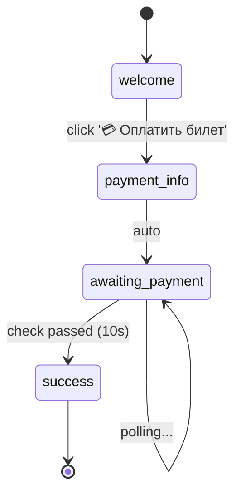

# Graph Builder API - Полное руководство

## Что было создано

Декларативный фреймворк для построения Telegram ботов с автоматической визуализацией user flow.

## 📦 Структура

```
bot_flow/
├── core/
│   ├── state.py          # StateNode, Flow, PollingConfig - базовые классы
│   ├── builder.py        # FlowBuilder, StateBuilder - Fluent API
│   ├── executor.py       # FlowExecutor - выполнение flow
│   └── visualizer.py     # FlowVisualizer - генерация диаграмм
├── flows/
│   └── payment_flow.py   # Пример: декларативный payment_bot
├── examples/
│   └── demo.py           # 5 примеров различных ботов
└── README.md             # Полная документация
```

## 🎯 Ключевые идеи

### 1. Декларативность через Fluent API

**Вместо императивного:**
```python
# 232 строки кода с размазанной логикой
async def start(update, context):
    # ...
async def payment_button(update, context):
    # ...
async def check_payment_status(...):
    while True:
        await asyncio.sleep(10)
        # ...
```

**Используем декларативный:**
```python
# ~40 строк декларативного описания
flow = (
    FlowBuilder("payment_bot")
    .state("welcome").on_command("/start").reply("Hi").button("Pay", goto="payment")
    .state("payment").poll(check_payment, interval=10).on_condition(is_paid, goto="success")
    .state("success").reply("Done!").final()
    .build()
)
```

### 2. Автоматическая визуализация

```python
# Одна строка - полная визуализация
visualize(flow).export_mermaid("docs/payment_flow.md")
```

Результат:



### 3. Встроенная валидация

```python
flow = (
    FlowBuilder("bot")
    .state("A").button("Go", goto="NONEXISTENT")
    .build()  # ❌ ValueError: State 'NONEXISTENT' does not exist
)
```

### 4. Контекст для данных

```python
async def create_payment(ctx: FlowContext):
    record_id = await api.create(ctx.user.id)
    ctx.set('record_id', record_id)  # Сохранить

async def check_payment(ctx: FlowContext) -> bool:
    record_id = ctx.get('record_id')  # Получить
    return await api.check(record_id)
```

### 5. Polling для асинхронных проверок

```python
.state("awaiting_payment")
    .poll(check_payment_in_nocodb, interval=10)  # Каждые 10 сек
    .on_condition(lambda ctx: ctx.poll_result, goto="success")
```

## 🚀 Как использовать

### Шаг 1: Визуализация payment_bot

```bash
# Сгенерировать диаграммы существующего payment_bot
python3 visualize_payment_flow.py

# Результат:
# ✅ docs/payment_flow.md (Mermaid)
# ✅ docs/payment_flow.dot (GraphViz)
# ✅ docs/payment_flow.txt (ASCII)
```

### Шаг 2: Запуск примеров

```bash
# Визуализировать все примеры
python3 bot_flow/examples/demo.py visualize

# Запустить конкретный пример
export BOT_TOKEN="your_token_here"
python3 bot_flow/examples/demo.py run welcome
python3 bot_flow/examples/demo.py run menu
python3 bot_flow/examples/demo.py run timer
```

### Шаг 3: Создать свой бот

```python
from bot_flow.core import FlowBuilder, FlowContext, FlowExecutor
import os

# Определить actions
async def my_action(ctx: FlowContext):
    print(f"User: {ctx.user.first_name}")
    ctx.set('data', 'value')

# Построить flow
flow = (
    FlowBuilder("my_bot")

    .state("start")
        .on_command("/start")
        .reply("Привет, {user.first_name}!")
        .button("Далее", goto="next")

    .state("next")
        .action(my_action)
        .reply("Данные сохранены!")
        .final()

    .build()
)

# Визуализация
from bot_flow.core import visualize
visualize(flow).export_mermaid("my_bot_flow.md")

# Запуск
executor = FlowExecutor(flow, os.getenv("BOT_TOKEN"))
executor.run()
```

## 📊 Сравнение подходов

| Критерий | Императивный | FlowBuilder |
|----------|-------------|-------------|
| Строк кода | 232 | ~40 |
| Видимость flow | ❌ Размазано | ✅ Сразу виден |
| Визуализация | ❌ Вручную | ✅ Автоматически |
| Валидация | ❌ В runtime | ✅ При построении |
| Тестирование | ❌ Сложно | ✅ Простое |
| Расширение | ❌ Дублирование кода | ✅ 3-5 строк |

## 🎨 Паттерны использования

### Паттерн 1: Простой линейный flow

```python
flow = (
    FlowBuilder("linear")
    .state("step1").on_command("/start").reply("Step 1").button("Next", goto="step2")
    .state("step2").reply("Step 2").button("Next", goto="step3")
    .state("step3").reply("Step 3").final()
    .build()
)
```

### Паттерн 2: Меню с возвратом

```python
flow = (
    FlowBuilder("menu")
    .state("menu")
        .on_command("/start")
        .reply("Menu:")
        .button("Option A", goto="option_a")
        .button("Option B", goto="option_b")

    .state("option_a")
        .reply("You chose A")
        .button("Back", goto="menu")

    .state("option_b")
        .reply("You chose B")
        .button("Back", goto="menu")

    .build()
)
```

### Паттерн 3: Условные переходы

```python
async def check_age(ctx: FlowContext) -> bool:
    age = ctx.get('age', 0)
    return age >= 18

flow = (
    FlowBuilder("age_gate")
    .state("check")
        .action(lambda ctx: ctx.set('age', 20))
        .poll(check_age, interval=0)  # Проверка сразу
        .on_condition(lambda ctx: ctx.poll_result, goto="adult")
        # Если False, можно добавить on_false_goto="minor"
    .build()
)
```

### Паттерн 4: Polling для асинхронных операций

```python
async def start_task(ctx):
    task_id = await api.start_long_task()
    ctx.set('task_id', task_id)

async def check_task_done(ctx) -> bool:
    task_id = ctx.get('task_id')
    return await api.is_done(task_id)

flow = (
    FlowBuilder("async_task")
    .state("start")
        .action(start_task)
        .reply("Task started...")
        .poll(check_task_done, interval=5)
        .on_condition(lambda ctx: ctx.poll_result, goto="done")
    .build()
)
```

## 🧪 Тестирование flow

```python
import pytest
from bot_flow.core import visualize

def test_flow_structure():
    flow = build_my_flow()

    # Проверка состояний
    assert flow.has_state("welcome")
    assert flow.has_state("payment")

    # Проверка переходов
    welcome = flow.get_state("welcome")
    assert welcome.has_transition_to("payment")

    # Проверка пути
    path = flow.find_path("welcome", "success")
    assert path == ["welcome", "payment", "awaiting", "success"]

def test_flow_validation():
    # Позитивный тест
    flow = build_valid_flow()
    errors = flow.validate()
    assert len(errors) == 0

    # Негативный тест - несуществующий переход
    with pytest.raises(ValueError):
        FlowBuilder("bad")
            .state("A").button("Go", goto="NONEXISTENT")
            .build()

def test_flow_visualization():
    flow = build_my_flow()
    mermaid = visualize(flow).to_mermaid()

    # Проверка наличия ключевых переходов
    assert "welcome --> payment" in mermaid
    assert "success --> [*]" in mermaid
```

## 📈 Следующие шаги

### Возможные улучшения

1. **Middleware support**
   ```python
   .middleware(log_transitions)
   .middleware(analytics_tracker)
   ```

2. **Subflows (вложенные flow)**
   ```python
   .state("checkout").subflow(payment_flow).on_complete(goto="success")
   ```

3. **Error handling**
   ```python
   .state("payment").on_error(goto="error_state")
   ```

4. **Rich context**
   ```python
   ctx.db  # Доступ к БД
   ctx.cache  # Кеш
   ctx.api  # Внешние API
   ```

5. **Интерактивная визуализация**
   ```python
   visualize(flow).export_html("flow.html", interactive=True)
   ```

## 🎓 Обучение

### Рекомендуемый порядок изучения

1. **Начните с примеров**
   ```bash
   python3 bot_flow/examples/demo.py visualize
   ```

2. **Изучите payment_flow.py**
   - Посмотрите декларативное описание
   - Сравните с оригинальным payment_bot.py
   - Изучите actions (create_payment_record, check_payment_status)

3. **Создайте простой бот**
   - Скопируйте пример welcome_bot
   - Добавьте свои состояния
   - Визуализируйте

4. **Добавьте сложную логику**
   - Actions для работы с API
   - Polling для асинхронных проверок
   - Условные переходы

## ❓ FAQ

**Q: Как добавить несколько кнопок в ряд?**

A: Сейчас кнопки добавляются по одной в столбик. Для кастомной раскладки можно расширить API:
```python
.buttons_row([
    ("Button 1", "goto1"),
    ("Button 2", "goto2")
])
```

**Q: Как обрабатывать текстовый ввод пользователя?**

A: Используйте `.on_message()` триггер и обрабатывайте `update.message.text` в action:
```python
async def save_user_input(ctx):
    text = ctx.update.message.text
    ctx.set('user_input', text)

.state("ask_name")
    .on_message()
    .action(save_user_input)
```

**Q: Можно ли использовать с aiogram вместо python-telegram-bot?**

A: Да! Нужно написать альтернативный `AiogramFlowExecutor`. Архитектура позволяет менять executor.

**Q: Как добавить логирование?**

A: Добавьте wrapper для actions или используйте middleware (будущая фича).

## 📚 Дополнительные ресурсы

- [bot_flow/README.md](../bot_flow/README.md) - API reference
- [bot_flow/examples/demo.py](../bot_flow/examples/demo.py) - 5 примеров ботов
- [docs/payment_flow.md](payment_flow.md) - Визуализация payment_bot

---

**Создано с помощью Claude Code** 🤖
