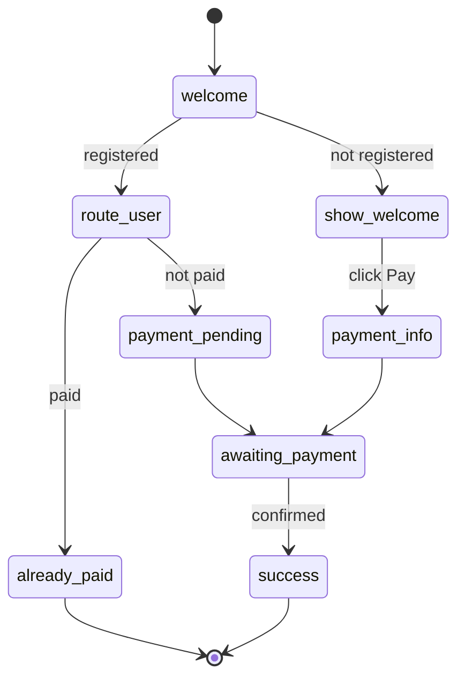

# Payment Flow Improvements

## Дата: 2025-10-19

## Улучшения логики

### До

```
/start → Check registration
  ├─> already_registered (if registered) → END
  └─> show_welcome (if not registered) → payment_info → success
```

**Проблема:** Если пользователь зарегистрирован, но ещё не оплатил, бот показывал "уже зарегистрирован" и не давал продолжить оплату.

### После

```
/start → Check registration
  ├─> already_paid (if registered AND paid) → Show group link, END
  ├─> payment_pending (if registered BUT NOT paid) → Continue polling → success
  └─> show_welcome (if not registered) → payment_info → awaiting_payment → success
```

**Решение:** Бот теперь различает 3 сценария:
1. **Зарегистрирован и оплатил** → Показываем ссылку на группу
2. **Зарегистрирован, но не оплатил** → Напоминаем об ожидании, продолжаем polling
3. **Не зарегистрирован** → Стандартный flow регистрации

## Изменения в коде

### 1. Переименование состояния

- `already_registered` → `already_paid` (более точное название)

### 2. Новое состояние

- `route_user` - роутер для проверки статуса оплаты зарегистрированного пользователя
- `payment_pending` - сообщение для пользователей, ожидающих подтверждения

### 3. Улучшенная функция проверки

```python
async def check_user_registration(ctx: FlowContext) -> bool:
    """
    Check if user is already registered (has a record in NocoDB).

    Sets context variables:
    - 'already_registered': True if user has a record
    - 'payment_confirmed': True if user has paid
    - 'record_id': NocoDB record ID if found

    Returns True if user is registered (paid or unpaid), False otherwise.
    """
```

Теперь функция сохраняет `payment_confirmed` в контексте для последующей проверки.

## Flow States

### welcome
- **Trigger:** `/start`
- **Action:** Загружает тексты и конфиг из NocoDB
- **Polling:** Проверяет регистрацию пользователя (1 раз, interval=1s)
- **Transitions:**
  - Если зарегистрирован → `route_user`
  - Если не зарегистрирован → `show_welcome`

### route_user
- **Роль:** Router state - определяет, оплачен ли билет
- **Polling:** Проверяет `payment_confirmed` из контекста
- **Transitions:**
  - Если оплачено → `already_paid`
  - Если не оплачено → `payment_pending`

### show_welcome
- **Для:** Новых пользователей
- **Message:** Приветственное сообщение
- **Button:** "Оплатить билет" → `payment_info`

### payment_pending
- **Для:** Зарегистрированных, но не оплативших пользователей
- **Message:** "Ожидаем подтверждение вашей оплаты..."
- **Transition:** Auto → `awaiting_payment`

### already_paid
- **Для:** Уже оплативших пользователей
- **Message:** "Вы уже оплатили билет!" + ссылка на группу
- **Final:** Да

### payment_info
- **Trigger:** Callback `pay_ticket`
- **Action:** Создаёт запись в NocoDB
- **Message:** Инструкции по оплате
- **Transition:** Auto → `awaiting_payment`

### awaiting_payment
- **Polling:** Проверяет статус оплаты каждые 10 секунд
- **Transitions:**
  - Если оплачено → `success`

### success
- **Message:** "Оплата подтверждена!" + ссылка на группу
- **Final:** Да

## User Scenarios

### Scenario 1: Новый пользователь

```
1. /start
2. welcome → check_user_registration() → False
3. show_welcome: "Добро пожаловать!"
4. Пользователь нажимает "Оплатить билет"
5. payment_info: создаёт запись в NocoDB
6. awaiting_payment: polling каждые 10 секунд
7. Админ подтверждает оплату в NocoDB
8. success: "Оплата подтверждена!"
```

### Scenario 2: Зарегистрирован, но не оплатил

```
1. /start
2. welcome → check_user_registration() → True, payment_confirmed = False
3. route_user → payment_confirmed = False
4. payment_pending: "Ожидаем подтверждение вашей оплаты"
5. awaiting_payment: продолжает polling
6. Админ подтверждает оплату
7. success: "Оплата подтверждена!"
```

### Scenario 3: Уже оплатил

```
1. /start
2. welcome → check_user_registration() → True, payment_confirmed = True
3. route_user → payment_confirmed = True
4. already_paid: "Вы уже оплатили билет!" + ссылка на группу
5. END
```

## Преимущества

### 1. Лучший UX
- Пользователь не застревает на "уже зарегистрирован"
- Ясное сообщение о текущем статусе
- Автоматическое продолжение polling для незавершённых оплат

### 2. Предотвращение ошибок
- Нельзя создать дубликат регистрации
- Нельзя зарегистрироваться дважды
- Зарегистрированные пользователи автоматически получают правильное сообщение

### 3. Прозрачность
- Понятно, на каком этапе находится пользователь
- Админу видно статус в NocoDB
- Polling продолжается автоматически

## Визуализация

Обновлённая диаграмма: [docs/payment_flow.md](payment_flow.md)



## Testing

```bash
# Generate updated visualization
.venv/bin/python -c "
import sys, asyncio
sys.path.insert(0, '.')
from bot_flow.flows.payment_flow import build_payment_flow
from bot_flow.core import visualize

async def main():
    flow = await build_payment_flow()
    viz = visualize(flow)
    viz.export_mermaid('docs/payment_flow.md')
    print('✅ Done!')

asyncio.run(main())
"

# Run bot
python main.py payment
```

## Migration Notes

**Breaking Changes:** Нет

**Database Changes:** Нет

**Config Changes:**
- В NocoDB можно добавить новый текст `already_paid_message` (опционально)

**Backward Compatibility:** Полная

Старые пользователи автоматически получат правильный flow при следующем `/start`.
