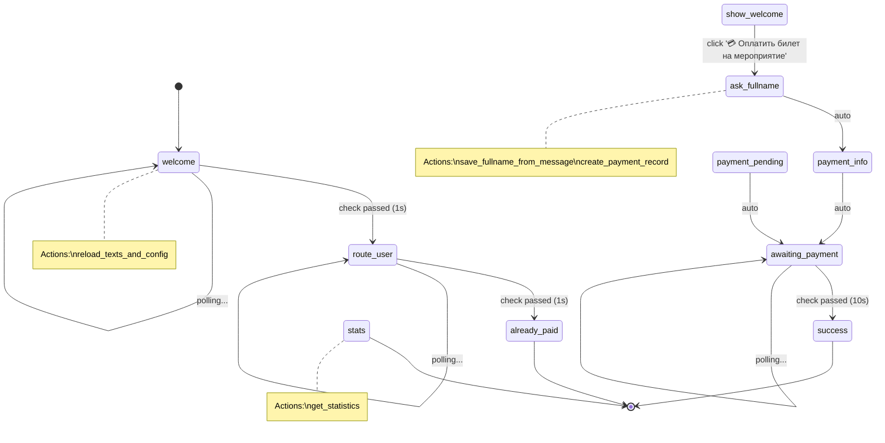

# payment_bot - Flow Diagram

```mermaid
stateDiagram-v2
    [*] --> welcome
    welcome --> route_user: check passed (1s)
    welcome --> welcome: polling...
    note right of welcome
        Actions:\nreload_texts_and_config
    end note
    route_user --> already_paid: check passed (1s)
    route_user --> route_user: polling...
    show_welcome --> ask_fullname: click '💳 Оплатить билет на мероприятие'
    ask_fullname --> payment_info: auto
    note right of ask_fullname
        Actions:\nsave_fullname_from_message\ncreate_payment_record
    end note
    payment_pending --> awaiting_payment: auto
    already_paid --> [*]
    payment_info --> awaiting_payment: auto
    awaiting_payment --> success: check passed (10s)
    awaiting_payment --> awaiting_payment: polling...
    success --> [*]
    stats --> [*]
    note right of stats
        Actions:\nget_statistics
    end note
```
