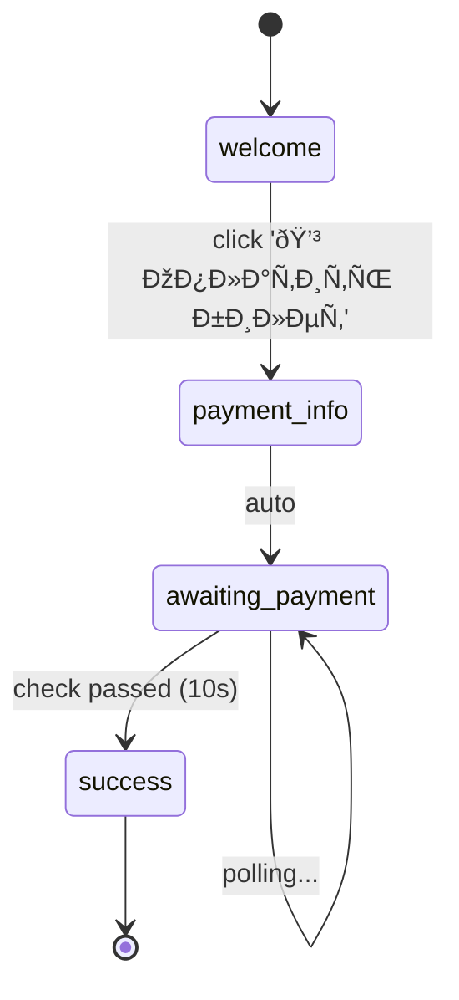

# payment_bot - Flow Diagram

```mermaid
stateDiagram-v2
    [*] --> welcome
    welcome --> payment_info: click '💳 Оплатить билет'
    payment_info --> awaiting_payment: auto
    awaiting_payment --> success: check passed (10s)
    awaiting_payment --> awaiting_payment: polling...
    success --> [*]
```
