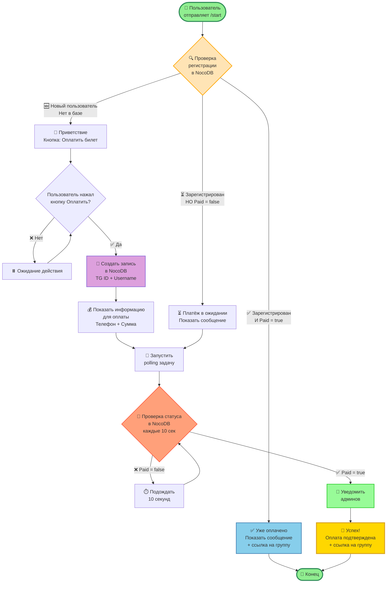

# Payment Bot - Detailed Flow Visualization

## Детальная схема работы бота



## Описание состояний

### 1. Начало (START)
- Пользователь отправляет команду `/start`
- Бот получает информацию о пользователе (user_id, username)

### 2. Проверка регистрации (CHECK_USER)
- Запрос к NocoDB по полю `TG ID`
- Три возможных сценария:
  - ✅ Найден + Paid = true → Уже оплачено
  - ⏳ Найден + Paid = false → Платёж в ожидании
  - 🆕 Не найден → Новый пользователь

### 3. Три ветки обработки

#### Ветка A: Уже оплачено (ALREADY_PAID)
- Показать сообщение: "Вы уже зарегистрированы и оплатили билет"
- Отправить ссылку на Telegram группу
- Завершение (END)

#### Ветка B: Новый пользователь (WELCOME → PAYMENT_INFO)
1. **WELCOME**: Приветствие с кнопкой "💳 Оплатить билет"
2. **PAYMENT_BTN**: Ожидание нажатия кнопки
3. **CREATE_RECORD**: Создание записи в NocoDB
   - Поля: TG ID, TG username, Price, Paid = false
4. **PAYMENT_INFO**: Показать инструкции
   - Номер телефона для перевода
   - Сумма платежа
5. **POLLING_START**: Запуск фоновой задачи проверки

#### Ветка C: Платёж в ожидании (PAYMENT_PENDING)
- Показать сообщение: "Ваш платёж в обработке"
- Продолжить polling (POLLING_START)

### 4. Polling цикл (POLL_CHECK)
- Проверка каждые 10 секунд
- Запрос к NocoDB: `GET /api/v2/tables/{table_id}/records/{record_id}`
- Проверка поля `Paid`
  - ❌ false → Ждать ещё 10 секунд
  - ✅ true → Переход к SUCCESS

### 5. Уведомление админов (NOTIFY_ADMIN)
- Отправка сообщения админам о новой оплате
- Ссылка на запись в NocoDB

### 6. Успех (SUCCESS)
- Сообщение: "✅ Оплата подтверждена!"
- Отправка ссылки на Telegram группу
- Завершение работы

## Технические детали

### NocoDB API
```python
# Проверка регистрации
GET /api/v2/tables/mfaob33z2nnrxve/records?where=(TG ID,eq,{user_id})

# Создание записи
POST /api/v2/tables/mfaob33z2nnrxve/records
{
  "TG": "@username",
  "TG ID": 123456789,
  "Price": 1000,
  "Paid": false
}

# Проверка статуса (polling)
GET /api/v2/tables/mfaob33z2nnrxve/records/{record_id}
```

### Polling механизм
```python
async def poll_payment_status(context: FlowContext):
    """Проверка статуса каждые 10 секунд"""
    while True:
        record = await nocodb.get_record(record_id)
        if record["Paid"] == True:
            return True  # Переход к SUCCESS
        await asyncio.sleep(10)
```

### State restoration
При перезапуске бота:
1. Загрузить все записи с `Paid = false`
2. Восстановить polling для каждой записи
3. Продолжить проверку статуса

## Примеры сообщений

### Welcome message
```
👋 Добро пожаловать, {user.first_name}!

🎉 Это бот для регистрации и оплаты билетов на мероприятие.

Нажмите кнопку ниже для оплаты билета.
```

### Payment info
```
💰 Информация для оплаты билета:

📱 Номер телефона: {PAYMENT_PHONE}
💵 Сумма: {PAYMENT_AMOUNT} руб.

📝 Инструкция:
1. Переведите указанную сумму на номер телефона
2. После перевода дождитесь подтверждения
3. Мы проверим оплату и отправим вам ссылку на группу

⏳ Ожидаем вашу оплату...
```

### Success message
```
✅ Оплата подтверждена! 🎊

Спасибо за регистрацию!

🔗 Ссылка на группу мероприятия:
{TELEGRAM_GROUP_LINK}

До встречи! 👋
```
